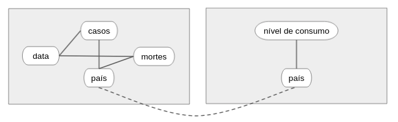

# Modelo para Apresentação do Lab01 - API Acesso
Estrutura da pasta

```
README.md      <- arquivo apresentando a tarefa
│
├── images     <- arquivo de imagem da tarefa
│
└── notebook   <- arquivos do notebook
```


# Aluno
183465: Maria Angélica Lobo

# Tarefa 1 sobre APIs de acesso
[notebook](notebook/notebook.ipynb)

# Tarefa 2 sobre Engenharia Reversa
